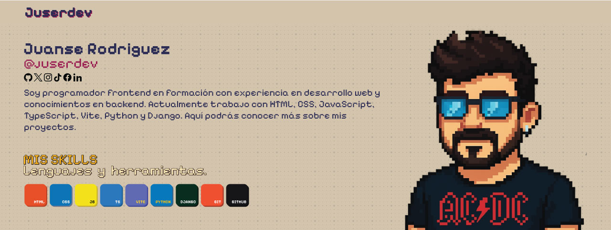

# Sebastián Rodríguez — Desarrollador Web
 
 
 
 Soy estudiante enfocado en desarrollo web frontend. Me interesan las interfaces claras, el código organizado y aprender tecnologías modernas para construir soluciones útiles.
 
 ## Sobre mí
 Disfruto resolver retos y mantener un aprendizaje constante. Actualmente estoy fortaleciendo fundamentos de frontend y explorando backend con Python/Django para crear aplicaciones completas.

 --- 

  ## Tecnologías
  

    
    
    
    
    
    
  

  ---
 
 ## Proyectos destacados
 - [steelcook](https://github.com/Juserdev/steelcook) — App/prototipo relacionado con cocina o recetas.
 - [simple-quoting-system](https://github.com/Juserdev/simple-quoting-system) — Sistema simple de cotizaciones.
 - [landing_django](https://github.com/Juserdev/landing_django) — Landing creada con Django o enfocada en despliegue rápido. {{ ... }}
 - [trusk](https://github.com/Juserdev/trusk) — Proyecto/práctica con enfoque en JavaScript o UI.
 
 ## En qué estoy trabajando
 - Consolidando bases de JavaScript.
 - Introducción a Django para crear APIs y vistas.
 
 ## Cómo contactarme
 - Email: juserdev@gmail.com
 - LinkedIn: [Juan Sebastian Rodriguez](https://www.linkedin.com/in/jserodriguezr/)
 - Portafolio/Sitio: [Juserdev](https://juserdev.github.io)
 
 ## Más repositorios
 - Todos mis repositorios: [GitHub](https://github.com/Juserdev?tab=repositories)
 - Prácticas y retos:
   - [roadmap-retos-programacion](https://github.com/Juserdev/roadmap-retos-programacion)
   - [Curso-de-Django](https://github.com/Juserdev/Curso-de-Django)

